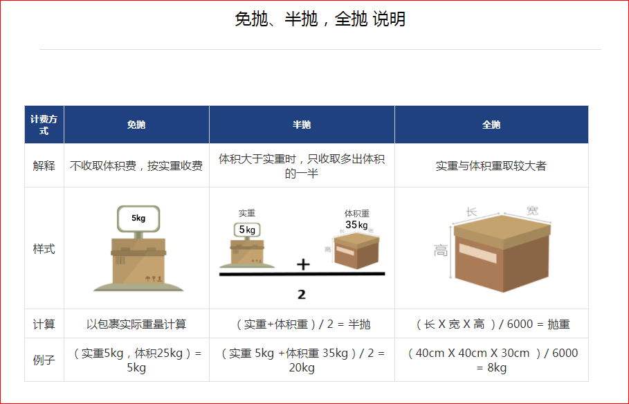

### 什么是实重，抛重，全抛，半抛，免抛？
- [来源](https://cncexpress.my/%E4%BB%80%E4%B9%88%E6%98%AF%E5%AE%9E%E9%87%8D%EF%BC%8C%E6%8A%9B%E9%87%8D%EF%BC%8C%E5%85%A8%E6%8A%9B%EF%BC%8C%E5%8D%8A%E6%8A%9B%EF%BC%8C%E5%85%8D%E6%8A%9B%EF%BC%9F)
```text
以一个实际重量5kg 体积50cm*40cm*60cm的包裹，运费1kg=RM15，作为例子。

实重》实际重量=5kg

抛重》当你的包裹很轻，但体积却很大，则会按照体积来算出一个体积重。也就是所谓的抛重。
抛重的计算方法一般是 包裹的 ： 长(cm) * 高(cm)  * 宽(cm) /6000
50*40*60/6000=20.00
那么你包裹的抛重就是  20kg

全抛》包裹的运费，依实重或抛重，哪个更大，则按照哪个来计算
全抛运费=20kg*RM15=RM300

半抛》包裹的运费，依(实重+抛重)/2来计算
(5+20)/2=12.50（进位13kg）
半抛运费=13kg*RM15=RM195

免抛》又分为10kg免抛，20kg免抛，30kg免抛。符合规定下，包裹的运费，依实重收费。
10kg免抛=抛重 减去 实重 “不超过10kg 则按照实重收费” “超过10kg 则按照半抛收费”
20-5=15kg 超过10kg 按照半抛收费
(5+20)/2=12.50（进位13kg）
10kg免抛运费=13kg*RM15=RM195

20kg免抛=抛重 减去 实重 “不超过20kg 则按照实重收费” “超过20kg 则按照半抛收费”
20-5=15kg 不超过20kg 按照实重收费
20kg免抛运费=5kg*RM15=RM75

30kg免抛=抛重 减去 实重 “不超过30kg 则按照实重收费” “超过30kg 则按照半抛收费”
20-5=15kg 不超过30kg 按照实重收费
30kg免抛运费=5kg*RM15=RM75
```

### 免抛、半抛和实重的说明和区别
- [来源](https://ws6631.com/index.php?route=information/information&information_id=12)
- 
```text
「实重」与「体积重」拋重大于10KG的情况下，享有半抛！


例子一 : 免抛

重量 : 3kg

体积 : 40cm X 30cm X 40cm /6000 = 8kg

计费：拋重少于10KG，享有免抛，按 3kg 收费


例子二 : 半抛

重量  : 8kg

体积  : 60cm X 60cm X 60cm /6000 =36kg

计费：拋重超过10KG，按半抛计算（8kg+36kg）/ 2 = 22kg 收费


例子三 : 全抛

重量  : 12kg

体积  :40cm X 40cm X 60cm /6000 = 16kg

计费：实重与体积重取较大者，超过10KG全抛,按 16kg 收费

```

### 敦豪DHL国际报价
- [来源](http://www.wjexpress.com/dhlbj.asp)
```text
体积重大于实重时取体积重；（体积重=长*宽*高/5000立方厘米计算）
```

### 国际快递费怎么计算？DHL、TNT、UPS、FEDEX四大快递费用计算方法
- [来源](https://www.5684.com/news/article/10040.html)
```text
为方便广大国际快递使用者，使用国际快递，我们在这里主要介绍国际快递四巨头（DHL\UPS\FEDEX\TNT)及EMS中国邮政快递计算方法。一般国际快递中主要包含运费、燃油附加费及其他费用。备注：EMS无燃油附加费。

 
    一、国际快递计费单位：
五大常用国际快递公司的计费单位都是公斤(KG)。DHL、UPS、FEDEX、TNT一般是21KG以下按手续中收费，即首总费用=重费用+续重费用。计费重量最小单位0.5KG，不足0.5KG的按0.5KG计费，超过0.5KG不超过1KG的按1KG计费，以此类推。以第一个0.5KG为首重，以每增加一个0.5KG为续重。例如：1.67KG就按2KG计费。通常首重的费用相对续重费用较高。21KG以上一般直接按照每公斤计费，多出1KG不超过第二个1KG 计费重量要多加1KG。例如34.1KG要按35KG计费，34.9KG也是按35KG计费。EMS每票货物货物不能超过30KG ，所有的货物都按首续重计费。

  
      二、重量的计算：
国际快递中（除EMS外）重量具体可以分为实际重量，材积重量，计费重量。实际重量是指货物包含包装在内的总重量。体积重量是指因运输工具承载能力即能装载物品体积所限，所采取的将货件体积折算成重量的重量即为体积重量或材积。目前国际快递体积重量的计算方法是：体积重量=长（CM）*宽（CM）*高（CM）/5000 （CM）不规则的包装则按照货物单边最长、最宽、最高点计算。国际快递中体积重量大于实际重量的货件又常称为抛货。 
计费重量：将整票货物的实际重量与体积重量比较，取大的为计费重量。例如：一票货物的总实际重量是60KG  体积是：60CM*80CM*70CM/5000=67.2 那么计费重量就是68KG。因为67《67.2KG《68KG ，所有计费重量是68KG。   


      三、燃油附加费：
燃油附加费（Fuel oil surcharge / fuel adjustment factor）。航运公司和班轮公会收取的反映燃料价格变化的附加费。该费用以每运输吨多少金额或者以运费的百分比来表示。缩写为f.o.s.或f.a.f.。也称作Bunker surcharge或Bunker adjustment factor。所有的燃油附加费都可以通过官方网网站查询,像HL,UPS,TNT,FEDEX都可以通过官网查到相对应的当月燃油附加费。燃油附加费计一般会同运费一起打折。        

     四、计费公式： 

A.21KG以下货物的计算方式：    1.实重货：实际重量>体积重量 
当需寄递物品实重大于材积时，运费计算方法为：运费（首重运费＋(重量（公斤）×2－1)×续重运费）+总燃油附加费（（首重运费＋(重量（公斤）×2－1)×续重运费）*当月燃油附加费率） 
简化公式（首重运费＋(重量（公斤）×2－1)×续重运费）*（1+当月燃油附加费率）  
例如：15KG货品按首重150元、续重28元当月燃油附加费率为23.5%计算，则运费总额为：（150＋(15×2-1)*28）*（1+23.5%）=1188.07 (元)  
  2. 材积货：实际重量<体积重量 
先计算材积重量，然后按照运费计算方法计算：首重运费＋(重量（公斤）×2－1)×续重运费 
规则物品：长（cm）×宽(cm)×高(cm)÷5000=重量（KG）

跨境电商的蓬勃发展，人们使用国际快递的频率也越来越高！那么国际快递的费用怎么计算？又有什么要求呢？其实DHL、TNT、UPS、FEDEX四大快递在费用计算有很多相同的地方，只有部分差异。今天我们就以美国为例给大家分享一下国际快递四大快递费用计算方法。

　　UPS快递

　　1.体积重量货物：对于体大质轻的包裹，按照国际航空运输协会的规定，根据体积重量和实际重量中

　　较重的一种收费。如果有2件货，一件计算体积重量，一件计算重量，然后相加为计费重量。

　　体积重量计算方式：（长×宽×高）cm÷5000=体积重量。

　　2.燃油附加费，根据市场情况会有更新，具体费用请咨询客服。

　　3.偏远地区服务费。根据收货地址决定是否收取，三个月内通知收取有效。

　　4.非规则形状物品每个包裹征收附加费，是包裹大小重新分类或收费。

　　5.单边超过269厘米，周长超过418厘米，重量超过69千克，拒绝收件。

　　6.主边长度超过151厘米，次长边超过75厘米或超重，会收取超标附加费。

　　7.保险：只对有账号客户提供的服务，公式为（申报金额-800）/800*3.2=保险金。

　　DHL快递

　　1.体积重量货物：对于体大质轻的包裹，按照国际航空运输协会的规定，根据体积重量和实际重量中

　　较重的一种收费。体积重量计算方式：（长×宽×高）cm÷5000=体积重量。

　　2.燃油附加费，根据市场情况每月会有变动。

　　3.偏远地区服务费，根据地址不同收费也会不同。

　　4.美国西部地区包括：华盛顿、内华达、州爱达荷、犹他、加利福尼亚、科罗拉多、俄勒冈和亚利桑

　　那等。

　　5.非标准货件附加费：对于单件任意一边的长度超过120厘米或单件实际重量超过70公斤的货件，会征

　　收非标准货件附加费，每票货物只征收一次。

　　6.保险：自主决定是否购买，国际快件支付投保金额的1%（最低保险费为人民币100元 ）。

　　7.关税：根据实际情况，有可能产生。

　　FEDEX联邦快递

　　1.偏远地区附加费：另加当月燃油附加费，此费用由交货公司支付，3个月内收取有效；

　　2.体积重量：（长×宽×高）cm÷5000=体积重量。

　　3.燃油附加费，每月更新。

　　4.单箱超过1吨，单边超过274厘米，不能承运。

　　TNT快递

　　1.燃油附加费，基本每月更新。

　　2.TNT针对偏远地区的取件及派送收取一定金额的偏远地区派送费。

　　3.体积重量货物：（长×宽×高）立方米×200公斤/立方米，根据体积重量与实际重量，两者取其高

　　；或者将包装的（长×宽×高）cm÷5000。根据货物大小选择。

　　4.安检费：每千克5毛钱，最低收5块，最高100块。

　　5.单件超过50千克收加托费。

　　6.保险：RMB2000元以下是2元，RMB2000元以上千分之四。

　　好了，四大快递公司的快递费用计算方法，大致就是这个情况，当然这些数据仅供参考，可能还会有其他费用，具体费用还要根据实际情况而定。
```